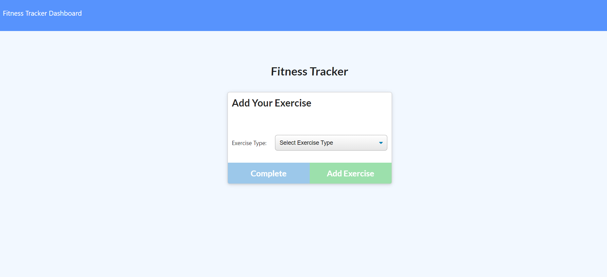
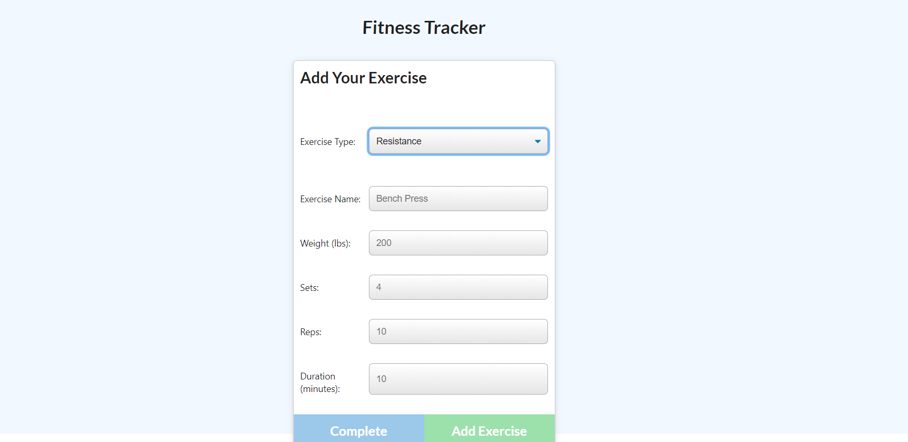
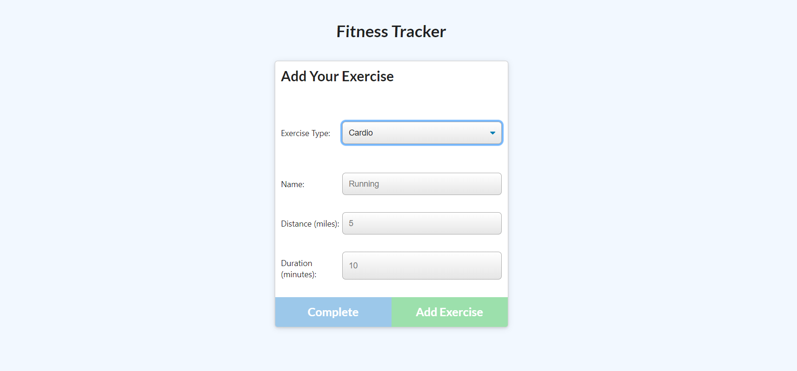

# workoutApp

## Table of Content
* [Project Links](#Project-Links)
* [Screenshots-Demo](#Screenshots)
* [Project Objective ](#Project-Objective)
* [Installation](#Installation)
* [Usage](#Usage)
* [Author Contact ](#Author-Contact)
* [License](#License)

## Project Links
https://github.com/netsy001/workoutApp

https://workoutappsuri.herokuapp.com/

## Screenshots - Demo
<kbd></kbd> <kbd></kbd> <kbd></kbd>

## Project Objective
AS A developer, I want to be able to view create and track daily workouts. I want to be able to log multiple exercises in a workout on a given day.

## Installation
In order to develop a workout App we need to instal visual studio code the code editor which is recommended. Github , MongoDb, Mongoose, heroku  are also necessary to deploy the project. We also need to install the node dependencies.

## Usage
In order to develop  workout APP we need to instal visual studio code the code editor which is recommended. Also require following technologies node.js,MongoDB, mongoose, Javascript, Markdowns. Github are  also necessary. We also need to install the node dependencies.For this project we highly recommend to get checkout npm docs and google heroku app and used it for deployment.

## Author Contact
Contact the author with any questions! 

Github link: [netsy001](https://github.com/netsy001)
    
Email: nettem.surendra@gmail.com

## License
This project is [MIT](https://choosealicense.com/licenses/MIT/) licensed. 
Copyright © [Surendra Nettam](https://github.com/netsy001)

                

<i>This Tech Blog was generated with ❤️ by Surendra Nettam</i >
; 